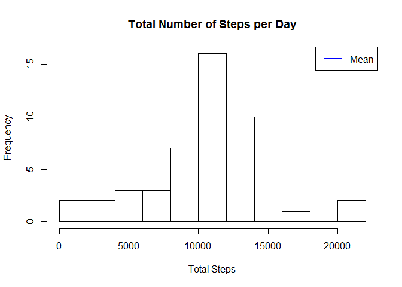
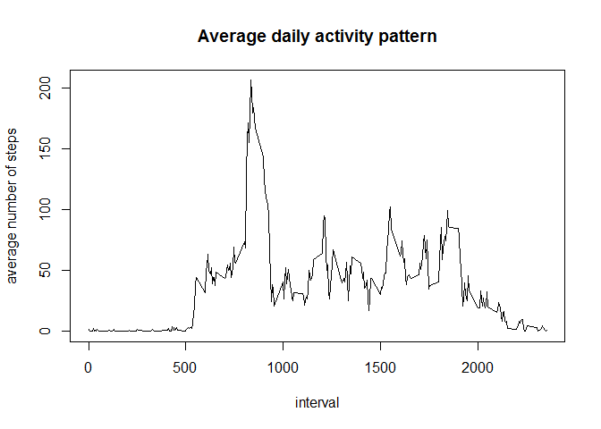
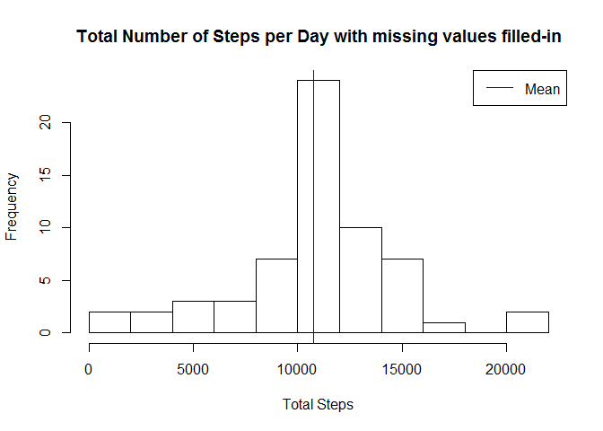
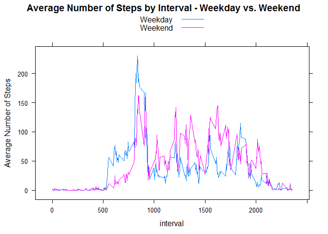
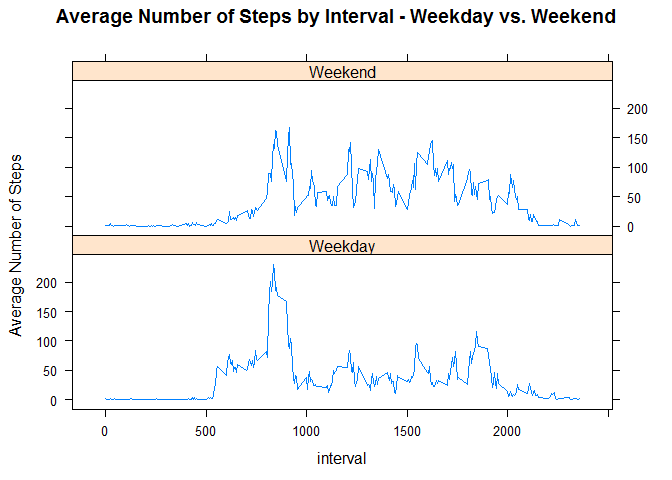

# Reproducible Research: Peer Assessment 1
  
Dataset: Activity monitoring data [52K]  
steps: Number of steps taking in a 5-minute interval (missing values are coded as NA)  
date: The date on which the measurement was taken in YYYY-MM-DD format  
interval: Identifier for the 5-minute interval in which measurement was taken   
  
The dataset is stored in a comma-separated-value (CSV) file and there are a total of 17,568 observations in this dataset.  
  
## Loading and preprocessing the data
1) Load the data  


```r
library(lubridate) ##for cleaning and transforming date variables
library(dplyr) ##for transforming and grouping data
library(lattice) ##for plotting
actdata <- read.csv("C:/Users/packee01/(C) My Documents/R/ReprodRes/activity.csv")  ##load data
```
  
  
2) Process/transform the data into a format suitable for your analysis  

```r
actdata$date <- ymd(actdata$date)  ##class conversion to POSIXct
```
  
  
##What is mean total number of steps taken per day?  
  
For this part of the assignment, you can ignore the missing values in the dataset.  
  
1) Make a histogram of the total number of steps taken each day  


```r
actdatastripped <- subset(actdata, is.na(actdata$steps) == FALSE)  ##create a subset with NA removed
totalsteps <- with(actdatastripped, tapply(steps,date,sum)) ##Compute total steps for each date
hist(totalsteps, main = "Total Number of Steps per Day", xlab = "Total Steps", breaks = 10)
abline(v=mean(totalsteps), col = "blue")
legend("topright", lty = 1, col = "blue", legend = "Mean")
```

 
  
2) Calculate and report the mean and median total number of steps taken per day  


```r
mean(totalsteps)
```

```
## [1] 10766.19
```

```r
median(totalsteps)
```

```
## [1] 10765
```


##What is the average daily activity pattern?  
  
1) Make a time series plot of the 5-minute interval (x-axis) and the average number of steps taken, averaged across all days (y-axis)  


```r
avgsteps <- actdatastripped %>% group_by(interval) %>% summarise(avg = mean(steps))
with(avgsteps, plot(interval,avg,type = "l",xlab = "interval", xlim=range(interval),
                    ylab = "average number of steps", main = "Average daily activity pattern"))
```

 

2) Which 5-minute interval, on average across all the days in the dataset, contains the maximum number of steps?  

```r
subset(avgsteps$interval,avgsteps$avg == max(avgsteps$avg))
```

```
## [1] 835
```
  
  
##Imputing missing values  

1) Here is the calculation and report of the total number of missing values in the dataset -

```r
sum(is.na(actdata$steps))
```

```
## [1] 2304
```

2) Devise a strategy for filling in all of the missing values in the dataset. The strategy does not need to be sophisticated. For example, you could use the mean/median for that day, or the mean for that 5-minute interval, etc.

To fill in all the missing values in the dataset, I will use mean for that 5-minute interval, which is readily available by referencing the "avgsteps" dataset extracted from the previous section.


```r
head(avgsteps)
```

```
## Source: local data frame [6 x 2]
## 
##   interval       avg
## 1        0 1.7169811
## 2        5 0.3396226
## 3       10 0.1320755
## 4       15 0.1509434
## 5       20 0.0754717
## 6       25 2.0943396
```

3) Create a new dataset that is equal to the original dataset but with the missing data filled in.


```r
actdatana <- subset(actdata, is.na(actdata$steps) == TRUE) ##create a dataset of only missing values
actdatanafilled <- inner_join(avgsteps,actdatana[,2:3], by = "interval")  ##combine the actdatana and 
##avgsteps dataset using the inner_join function from dplyr by matching on interval, and exclude the 
##NA value from actdatana
actdatanafilled <- rename(actdatanafilled, steps = avg) ##rename the column
actdatanafilled <- actdatanafilled[,c("steps","date","interval")] ##Reorder the columns to match 
##actdatastripped
actdatanafilled <- rbind(actdatanafilled,actdatastripped) ##combine the NA-only and NA-removed dataset
actdatanafilled <- actdatanafilled[order(actdatanafilled$date,actdatanafilled$interval),] ##reorder the 
##dataset by date and interval
```

4) Make a histogram of the total number of steps taken each day and calculate and report the mean and median total number of steps taken per day. Do these values differ from the estimates from the first part of the assignment? What is the impact of imputing missing data on the estimates of the total daily number of steps?

Here is the histogram - 
    

```r
totalstepsmod <- with(actdatanafilled, tapply(steps,date,sum)) ##Compute total steps for each date
hist(totalstepsmod, main = "Total Number of Steps per Day with missing values filled-in", 
     xlab = "Total Steps", breaks = 10)
abline(v=mean(totalsteps), col = "blue")
legend("topright", lty = 1, col = "blue", legend = "Mean")
```

 


Here is the mean and median of the dataset with the missing data filled-in - 


```r
mean(totalstepsmod)
```

```
## [1] 10766.19
```

```r
median(totalstepsmod)
```

```
## [1] 10766.19
```

Compare to the dataset with missing values removed, the mean of the new dataset remains the same, but the median changed went up very slight and is now identical to the mean. Based on this exercise, the impact of imputing missing data on the estimates of the total daily number of steps seems to provide a more normal distribution of the dataset.


##Are there differences in activity patterns between weekdays and weekends?  

For this part the weekdays() function may be of some help here. Use the dataset with the filled-in missing values for this part.  

1) Create a new factor variable in the dataset with two levels -- "weekday" and "weekend" indicating whether a given date is a weekday or weekend day.


```r
actdatanafilled$daytype <- with(actdatanafilled, ifelse(wday(date)== 1 | wday(date) == 7,"Weekend","Weekday"))
## add a new variable to the dataset with missing values filled-in to indicate weekend vs. weekday
```

2) Make a panel plot containing a time series plot (i.e. type = "l") of the 5-minute interval (x-axis) and the average number of steps taken, averaged across all weekday days or weekend days (y-axis). 

I will compare the weekend and weekday average steps using two different plots - the first plot shows both weekend and weekday values as overlapping lines.  The second plot shows them as vertical panels.

```r
avgstepsmod <- actdatanafilled %>% group_by(interval,daytype) %>% summarise(avg = mean(steps)) 
##Calculate the new average by interval and daytype
xyplot(avg~interval,avgstepsmod, type = "l", groups = daytype, 
       main = "Average Number of Steps by Interval - Weekday vs. Weekend", 
       ylab = "Average Number of Steps", auto.key = list(space = "top",points = FALSE, lines = TRUE)) 
```

 

```r
xyplot(avg~interval|daytype,avgstepsmod, type = "l", layout = c(1,2),
       main = "Average Number of Steps by Interval - Weekday vs. Weekend", 
       ylab = "Average Number of Steps", auto.key = list(space = "top",points = FALSE, lines = TRUE))
```

 
